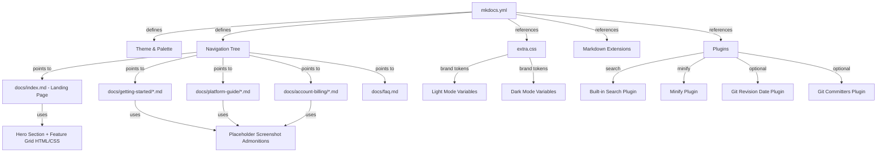

# Design Document: Customer Docs Site

## Overview

This design describes the implementation of the Loupe Factory customer-facing documentation site built with MkDocs Material, deployed on Vercel at docs.loupefactory.com.
The site serves as the primary resource for small and mid-size manufacturing and wholesale organizations using the Loupe Factory AI-native operations platform.

The implementation involves:
- Rewriting `mkdocs.yml` to define the correct navigation structure, theme, plugins, and extensions
- Expanding `docs/stylesheets/extra.css` with full brand color tokens for light and dark mode
- Creating all Markdown content pages referenced in the nav tree
- Building a branded landing page using MkDocs Material grid/card features
- Ensuring build integrity by removing dangling references (e.g., `javascripts/extra.js`)

There is no backend code. The entire deliverable is static site configuration (YAML), styling (CSS), content (Markdown), and optional HTML overrides.

## Architecture



The site follows a standard MkDocs Material architecture:
1. `mkdocs.yml` is the single source of truth for configuration
2. `docs/` contains all Markdown content organized by section
3. `docs/stylesheets/extra.css` provides brand overrides
4. `overrides/` provides Jinja2 template overrides (minimal use)
5. Vercel builds and serves the static output from `site/`

## Components and Interfaces

### 1. mkdocs.yml: Site Configuration

The central configuration file. Key changes from current state:

- **Navigation**: Replace the current placeholder nav with the full page tree matching Requirement 1
- **Plugins**: Make `git-revision-date-localized` and `git-committers` optional using environment variable guards to prevent build failures in environments without full git history (e.g., shallow clones on Vercel)
- **Extra JS**: Remove the `javascripts/extra.js` reference since the file does not exist and is not needed
- **Features**: Keep existing feature set; ensure `navigation.tabs`, `navigation.tabs.sticky`, `navigation.sections`, `navigation.indexes`, `toc.follow`, and `toc.integrate` are enabled for the sticky tab bar and sidebar TOC per Requirement 1.5
- **Palette**: Keep the three-mode palette (auto, light, dark) with `primary: custom` to allow CSS-driven brand colors

Nav structure:

```yaml
nav:
  - Home: index.md
  - Getting Started:
    - getting-started/index.md
    - Account Setup: getting-started/account-setup.md
    - Dashboard Overview: getting-started/dashboard-overview.md
    - Quick Start Guide: getting-started/quick-start-guide.md
  - Platform Guide:
    - platform-guide/index.md
    - Inventory Management: platform-guide/inventory-management.md
    - Production Tracking: platform-guide/production-tracking.md
    - Order Management: platform-guide/order-management.md
    - Invoicing: platform-guide/invoicing.md
    - Shipment Tracking: platform-guide/shipment-tracking.md
    - Customer & Supplier Management: platform-guide/customer-supplier-management.md
    - Employee Management: platform-guide/employee-management.md
    - Reporting & Analytics: platform-guide/reporting-analytics.md
  - Account & Billing:
    - account-billing/index.md
    - Managing Your Account: account-billing/managing-your-account.md
    - AI Credits & Billing: account-billing/ai-credits-billing.md
  - FAQ: faq.md
```

### 2. docs/stylesheets/extra.css: Brand Styling

Expanded CSS custom properties for both light and dark modes:

```css
/* Light mode (default) */
[data-md-color-scheme="default"] {
  --md-primary-fg-color: #3874ff;
  --md-primary-fg-color--light: #85a9ff;
  --md-primary-fg-color--dark: #003cc7;
  --md-accent-fg-color: #3874ff;
  --md-default-bg-color: #ffffff;
  --md-default-bg-color--light: #f5f7fa;
  --md-default-fg-color: #141824;
  --md-default-fg-color--light: #31374a;
  --lf-info: #0097eb;
  --lf-success: #25b003;
}

/* Dark mode (slate) */
[data-md-color-scheme="slate"] {
  --md-primary-fg-color: #3874ff;
  --md-primary-fg-color--light: #85a9ff;
  --md-primary-fg-color--dark: #003cc7;
  --md-accent-fg-color: #3874ff;
  --md-default-bg-color: #141824;
  --md-default-bg-color--light: #31374a;
  --md-default-fg-color: #f5f7fa;
  --md-default-fg-color--light: #ffffff;
  --lf-info: #0097eb;
  --lf-success: #25b003;
}
```

Additional CSS for:
- Landing page hero section and feature grid cards
- Placeholder screenshot admonition styling
- Button hover states using brand colors
- Card component styling for the landing page grid

### 3. docs/index.md: Landing Page

Uses MkDocs Material's `md_in_html` extension with `attr_list` for grid layouts. Structure:

1. **Hero section**: Full-width block with tagline aligned to the AI-native manufacturing and wholesale positioning, a brief description, and a CTA button linking to `getting-started/quick-start-guide.md`
2. **Feature grid**: A 3×2 card grid using Material's grid syntax, each card linking to the relevant Platform Guide page:
   - Inventory Management
   - Production Tracking
   - Order Management
   - Shipment Tracking
   - Reporting & Analytics
   - Invoicing (or another module-level capability as product marketing dictates)
3. **Getting Started steps**: A numbered 3-step section linking to Account Setup → Dashboard Overview → Quick Start Guide

The landing page uses `template: home.html` or hides the sidebar/TOC via front matter (`hide: [navigation, toc]`) to achieve a clean landing layout.

### 4. Content Pages: Markdown Files

Each content page follows a consistent template:

```markdown
# Page Title

Brief introduction paragraph.

## Section Heading

Content text explaining the feature/concept.

!!! info "Screenshot: [Description of what screenshot should show]"
    A screenshot will be added here showing [specific UI element or workflow].
    
    **Suggested image**: `assets/[descriptive-filename].png`

## Next Steps

- [Link to related page](../path/to/page.md)
```

Key conventions:
- Use `!!! info "Screenshot: ..."` admonitions as placeholder image annotations (Requirements 4.4, 8.2)
- All images referenced via `docs/assets/` path (Requirement 8.1)
- Include alt text descriptions in placeholder admonitions for future accessibility (Requirement 8.3)
- Cross-link between related pages (e.g., FAQ links to Platform Guide pages per Requirement 7.2)

### 5. Section Index Pages

Each nav section with sub-pages gets an `index.md` that provides a brief overview and links to child pages. This works with `navigation.indexes` feature to show section landing pages.

### 6. FAQ Page (docs/faq.md)

Organized using MkDocs Material's collapsible admonitions or details/summary blocks:

```markdown
## General
??? question "What is LoupeFactory?"
    LoupeFactory is an AI-powered operations platform... [See Platform Guide](platform-guide/index.md)

## Account
??? question "How do I reset my password?"
    You can reset your password by... [See Managing Your Account](account-billing/managing-your-account.md)
```

Categories: General, Account, Inventory, Production, Orders, Billing (Requirement 7.1).

### 7. Plugin Configuration

| Plugin | Status | Notes |
|--------|--------|-------|
| `search` | Required | Built-in, handles Requirements 9.1–9.3 |
| `minify` | Required | Minifies HTML output |
| `git-revision-date-localized` | Optional | Wrap with `!ENV [ENABLE_GIT_PLUGINS, false]` or use `enabled: !ENV [CI, false]` to skip in local/Vercel builds without full git history |
| `git-committers` | Optional | Same conditional enablement as above |

Design decision: The git plugins add "last updated" and contributor info but require full git history. Vercel's default shallow clone may not provide this. Making them conditional prevents build failures while preserving the feature for environments that support it.

## Data Models

This is a static site with no runtime data models. The "data" is:

### Content Structure

```text
docs/
├── index.md                          # Landing page
├── faq.md                            # FAQ page
├── getting-started/
│   ├── index.md                      # Section overview
│   ├── account-setup.md
│   ├── dashboard-overview.md
│   └── quick-start-guide.md
├── platform-guide/
│   ├── index.md                      # Section overview
│   ├── inventory-management.md
│   ├── production-tracking.md
│   ├── order-management.md
│   ├── invoicing.md
│   ├── shipment-tracking.md
│   ├── customer-supplier-management.md
│   ├── employee-management.md
│   └── reporting-analytics.md
├── account-billing/
│   ├── index.md                      # Section overview
│   ├── managing-your-account.md
│   └── ai-credits-billing.md
├── assets/                           # Image assets (empty initially)
└── stylesheets/
    └── extra.css                     # Brand overrides
```

### Configuration Schema (mkdocs.yml)

Key fields:
- `nav`: Array of section objects mapping labels to file paths
- `theme.palette`: Array of palette configurations (auto, light, dark)
- `theme.features`: Array of feature flag strings
- `plugins`: Array of plugin configurations
- `extra_css`: Array of CSS file paths
- `markdown_extensions`: Array of extension names/configs

## Error Handling

Since this is a static site generator, "errors" are build-time issues:

| Error Scenario | Handling Strategy |
|---|---|
| Nav references non-existent .md file | Ensure every nav entry has a corresponding file in `docs/` (Req 10.2) |
| Missing JavaScript file reference | Remove `javascripts/extra.js` from `extra_javascript` in mkdocs.yml (Req 10.3) |
| Git plugins fail without full history | Make git plugins conditional with `enabled: !ENV [CI, false]` (Req 10.1) |
| Missing image assets | Use placeholder admonitions instead of `` image syntax (Req 10.4, 8.2) |
| CSS variable undefined in one mode | Define all custom properties in both `[data-md-color-scheme="default"]` and `[data-md-color-scheme="slate"]` selectors |
| Build command fails on Vercel | Ensure `requirements.txt` includes all needed packages and `vercel.json` build command is correct |

## Testing Strategy

Property-based testing does not apply to this feature. The deliverable is a static documentation site composed of YAML configuration, CSS stylesheets, and Markdown content files. There are no pure functions, parsers, serializers, or algorithmic logic to validate with PBT. The appropriate testing strategies are:

### Build Verification (Smoke Tests)

- Run `mkdocs build --strict` to verify the site builds without errors or warnings
- This validates: all nav references resolve, no broken internal links, no missing extensions, no YAML syntax errors
- Covers Requirements 10.1, 10.2, 10.3

### File Existence Checks

- Verify every file referenced in `mkdocs.yml` nav exists in `docs/`
- Verify `extra_css` references exist
- Verify no `extra_javascript` references point to missing files
- Covers Requirements 10.2, 10.3

### Content Structure Validation

- Verify each content page contains the expected heading structure
- Verify placeholder screenshot admonitions use the correct format (`!!! info "Screenshot: ..."`)
- Verify FAQ page contains all required categories
- Covers Requirements 4.4, 7.1, 8.2

### Visual/Manual Review

- Verify light mode and dark mode render correctly with brand colors
- Verify landing page hero, feature grid, and getting started section display properly
- Verify navigation tabs, sidebar TOC, and search work as expected
- Covers Requirements 2.1–2.6, 3.1–3.4, 9.1–9.3

### Link Validation

- Verify all cross-references between pages resolve (e.g., FAQ → Platform Guide links)
- Verify CTA buttons on landing page link to correct destinations
- Covers Requirements 3.1, 3.3, 7.2
